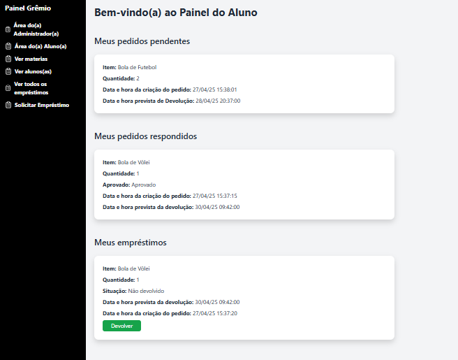
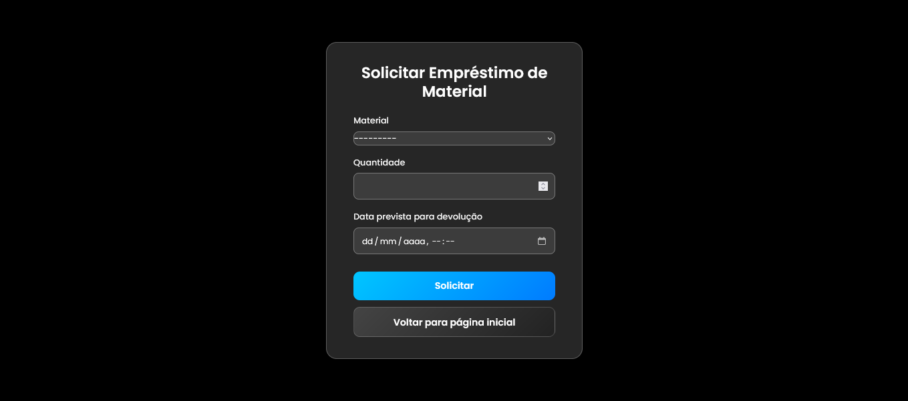
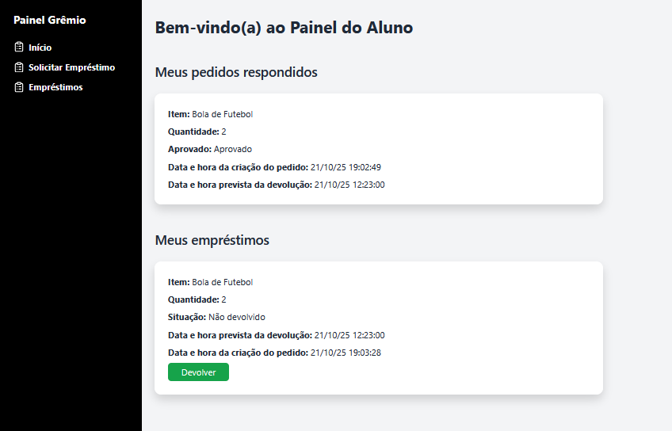
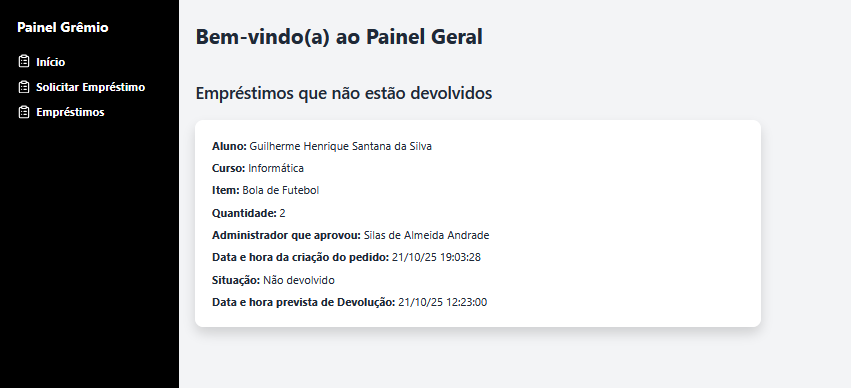
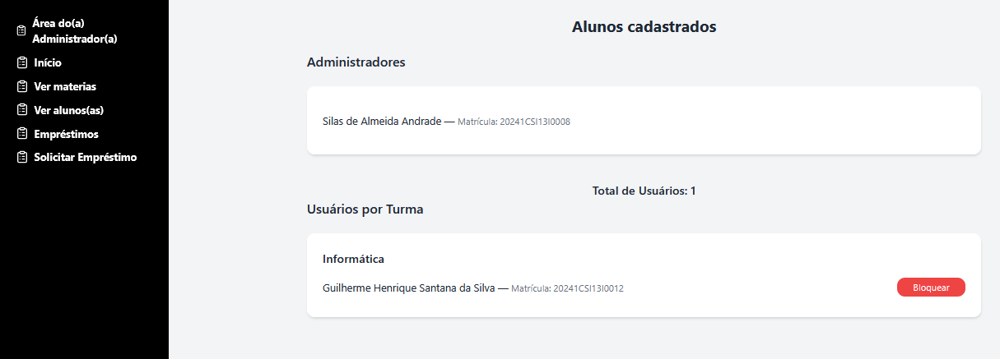

# loan-site

> loan-site is a website that manages loans

### Funcionalidades

- Sistema de Login, Logout e Cadastro
- Sistema de Pedido de empréstimo

- Sistema de devolução do empréstimo

- Sistema de ver todos os empréstimos feitos

- Sistema de bloquear usuários de fazerem empréstimos

## 🤝 Colaboradores

Agradecemos às seguintes pessoas que contribuíram para este projeto:

<table>
  <tr>
    <td align="center"> 
      <a href="https://github.com/Ghs-d" title="Front-End Developer"> 
      
        
       
        <b>
          Guilherme
        </b> 
       
    </a> 
    </td> 
    <td align="center"> 
      <a href="https://github.com/LucasmystOS" title="Back-End Developer"> 
      
        
       
        <b>
          Lucas Da Hora Vieira
        </b> 
       
    </a> 
    </td> 
  </tr>
</table>

## 📝 Licença

Esse projeto está sob licença. Veja o arquivo [LICENÇA](LICENSE) para mais detalhes.
